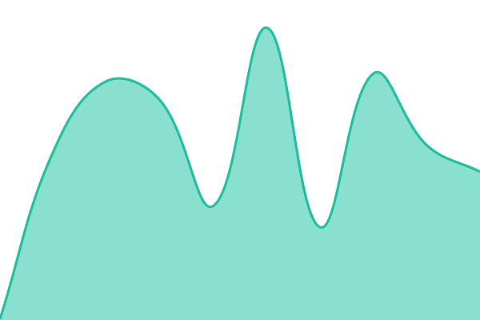
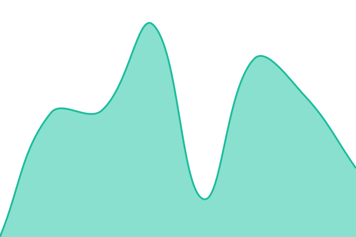
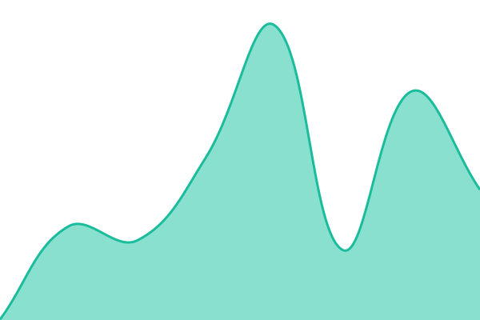
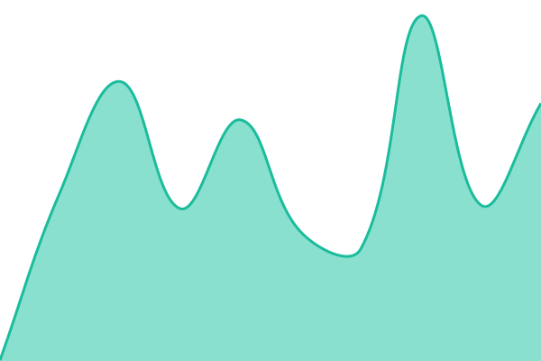

# Rajpoot Status

Uptime monitoring and status page for [rajpoot.dev](https://rajpoot.dev) and
related services, powered by [Upptime](https://upptime.js.org) — GitHub Actions,
Issues, and Pages. No servers, no third-party service.

> **Note on editing this file.** Summary CI regenerates the status table
> between the `status pages` HTML comment markers on every run — that part is
> machine-owned. It _also_ wholesale-replaces anything wrapped in Upptime's
> `docs` or `description` comment markers, so those two are deliberately **not
> used** in this file. Do not add them: everything below would be deleted on the
> next run. See `docs/ARCHITECTURE.md`.

[](https://github.com/AlzyWelzy/upptime/actions/workflows/uptime.yml)
[](https://github.com/AlzyWelzy/upptime/actions/workflows/validate.yml)
[](https://github.com/AlzyWelzy/upptime/actions/workflows/pipeline-health.yml)
[](https://github.com/AlzyWelzy/upptime/actions/workflows/response-time.yml)
[](https://github.com/AlzyWelzy/upptime/actions/workflows/site.yml)

<!-- The table below is generated by Summary CI, which emits rows without
     trailing pipes. These comments sit OUTSIDE the markers, so they survive
     regeneration. -->
<!-- markdownlint-disable MD055 MD056 -->
<!--start: status pages-->
<!-- This summary is generated by Upptime (https://github.com/upptime/upptime) -->
<!-- Do not edit this manually, your changes will be overwritten -->
<!-- prettier-ignore -->
| URL | Status | History | Response Time | Uptime |
| --- | ------ | ------- | ------------- | ------ |
|  [rajpoot.dev](https://rajpoot.dev) | 🟩 Up | [rajpoot-dev.yml](https://github.com/AlzyWelzy/upptime/commits/HEAD/history/rajpoot-dev.yml) | <details><summary> 416ms</summary><br><a href="https://status.rajpoot.dev/history/rajpoot-dev"></a><br><a href="https://status.rajpoot.dev/history/rajpoot-dev"></a><br><a href="https://status.rajpoot.dev/history/rajpoot-dev"></a><br><a href="https://status.rajpoot.dev/history/rajpoot-dev"></a><br><a href="https://status.rajpoot.dev/history/rajpoot-dev"></a></details> | <details><summary><a href="https://status.rajpoot.dev/history/rajpoot-dev">100.00%</a></summary><a href="https://status.rajpoot.dev/history/rajpoot-dev"></a><br><a href="https://status.rajpoot.dev/history/rajpoot-dev"></a><br><a href="https://status.rajpoot.dev/history/rajpoot-dev"></a><br><a href="https://status.rajpoot.dev/history/rajpoot-dev"></a><br><a href="https://status.rajpoot.dev/history/rajpoot-dev"></a></details>
|  [www.rajpoot.dev](https://www.rajpoot.dev) | 🟩 Up | [www-rajpoot-dev.yml](https://github.com/AlzyWelzy/upptime/commits/HEAD/history/www-rajpoot-dev.yml) | <details><summary> 112ms</summary><br><a href="https://status.rajpoot.dev/history/www-rajpoot-dev"></a><br><a href="https://status.rajpoot.dev/history/www-rajpoot-dev"></a><br><a href="https://status.rajpoot.dev/history/www-rajpoot-dev"></a><br><a href="https://status.rajpoot.dev/history/www-rajpoot-dev"></a><br><a href="https://status.rajpoot.dev/history/www-rajpoot-dev"></a></details> | <details><summary><a href="https://status.rajpoot.dev/history/www-rajpoot-dev">100.00%</a></summary><a href="https://status.rajpoot.dev/history/www-rajpoot-dev"></a><br><a href="https://status.rajpoot.dev/history/www-rajpoot-dev"></a><br><a href="https://status.rajpoot.dev/history/www-rajpoot-dev"></a><br><a href="https://status.rajpoot.dev/history/www-rajpoot-dev"></a><br><a href="https://status.rajpoot.dev/history/www-rajpoot-dev"></a></details>
|  [blog.rajpoot.dev](https://blog.rajpoot.dev) | 🟩 Up | [blog-rajpoot-dev.yml](https://github.com/AlzyWelzy/upptime/commits/HEAD/history/blog-rajpoot-dev.yml) | <details><summary> 149ms</summary><br><a href="https://status.rajpoot.dev/history/blog-rajpoot-dev"></a><br><a href="https://status.rajpoot.dev/history/blog-rajpoot-dev"></a><br><a href="https://status.rajpoot.dev/history/blog-rajpoot-dev"></a><br><a href="https://status.rajpoot.dev/history/blog-rajpoot-dev"></a><br><a href="https://status.rajpoot.dev/history/blog-rajpoot-dev"></a></details> | <details><summary><a href="https://status.rajpoot.dev/history/blog-rajpoot-dev">100.00%</a></summary><a href="https://status.rajpoot.dev/history/blog-rajpoot-dev"></a><br><a href="https://status.rajpoot.dev/history/blog-rajpoot-dev"></a><br><a href="https://status.rajpoot.dev/history/blog-rajpoot-dev"></a><br><a href="https://status.rajpoot.dev/history/blog-rajpoot-dev"></a><br><a href="https://status.rajpoot.dev/history/blog-rajpoot-dev"></a></details>
|  [scorefit.net](https://scorefit.net) | 🟩 Up | [scorefit-net.yml](https://github.com/AlzyWelzy/upptime/commits/HEAD/history/scorefit-net.yml) | <details><summary> 410ms</summary><br><a href="https://status.rajpoot.dev/history/scorefit-net"></a><br><a href="https://status.rajpoot.dev/history/scorefit-net"></a><br><a href="https://status.rajpoot.dev/history/scorefit-net"></a><br><a href="https://status.rajpoot.dev/history/scorefit-net"></a><br><a href="https://status.rajpoot.dev/history/scorefit-net"></a></details> | <details><summary><a href="https://status.rajpoot.dev/history/scorefit-net">100.00%</a></summary><a href="https://status.rajpoot.dev/history/scorefit-net"></a><br><a href="https://status.rajpoot.dev/history/scorefit-net"></a><br><a href="https://status.rajpoot.dev/history/scorefit-net"></a><br><a href="https://status.rajpoot.dev/history/scorefit-net"></a><br><a href="https://status.rajpoot.dev/history/scorefit-net"></a></details>
|  [rajpoot.me](https://rajpoot.me) | 🟥 Down | [rajpoot-me.yml](https://github.com/AlzyWelzy/upptime/commits/HEAD/history/rajpoot-me.yml) | <details><summary> 291ms</summary><br><a href="https://status.rajpoot.dev/history/rajpoot-me"></a><br><a href="https://status.rajpoot.dev/history/rajpoot-me"></a><br><a href="https://status.rajpoot.dev/history/rajpoot-me"></a><br><a href="https://status.rajpoot.dev/history/rajpoot-me"></a><br><a href="https://status.rajpoot.dev/history/rajpoot-me"></a></details> | <details><summary><a href="https://status.rajpoot.dev/history/rajpoot-me">20.74%</a></summary><a href="https://status.rajpoot.dev/history/rajpoot-me"></a><br><a href="https://status.rajpoot.dev/history/rajpoot-me"></a><br><a href="https://status.rajpoot.dev/history/rajpoot-me"></a><br><a href="https://status.rajpoot.dev/history/rajpoot-me"></a><br><a href="https://status.rajpoot.dev/history/rajpoot-me"></a></details>
|  [alzywelzy.com](https://alzywelzy.com) | 🟩 Up | [alzywelzy-com.yml](https://github.com/AlzyWelzy/upptime/commits/HEAD/history/alzywelzy-com.yml) | <details><summary> 297ms</summary><br><a href="https://status.rajpoot.dev/history/alzywelzy-com"></a><br><a href="https://status.rajpoot.dev/history/alzywelzy-com"></a><br><a href="https://status.rajpoot.dev/history/alzywelzy-com"></a><br><a href="https://status.rajpoot.dev/history/alzywelzy-com"></a><br><a href="https://status.rajpoot.dev/history/alzywelzy-com"></a></details> | <details><summary><a href="https://status.rajpoot.dev/history/alzywelzy-com">100.00%</a></summary><a href="https://status.rajpoot.dev/history/alzywelzy-com"></a><br><a href="https://status.rajpoot.dev/history/alzywelzy-com"></a><br><a href="https://status.rajpoot.dev/history/alzywelzy-com"></a><br><a href="https://status.rajpoot.dev/history/alzywelzy-com"></a><br><a href="https://status.rajpoot.dev/history/alzywelzy-com"></a></details>
|  [www.alzywelzy.com](https://www.alzywelzy.com) | 🟩 Up | [www-alzywelzy-com.yml](https://github.com/AlzyWelzy/upptime/commits/HEAD/history/www-alzywelzy-com.yml) | <details><summary> 245ms</summary><br><a href="https://status.rajpoot.dev/history/www-alzywelzy-com"></a><br><a href="https://status.rajpoot.dev/history/www-alzywelzy-com"></a><br><a href="https://status.rajpoot.dev/history/www-alzywelzy-com"></a><br><a href="https://status.rajpoot.dev/history/www-alzywelzy-com"></a><br><a href="https://status.rajpoot.dev/history/www-alzywelzy-com"></a></details> | <details><summary><a href="https://status.rajpoot.dev/history/www-alzywelzy-com">100.00%</a></summary><a href="https://status.rajpoot.dev/history/www-alzywelzy-com"></a><br><a href="https://status.rajpoot.dev/history/www-alzywelzy-com"></a><br><a href="https://status.rajpoot.dev/history/www-alzywelzy-com"></a><br><a href="https://status.rajpoot.dev/history/www-alzywelzy-com"></a><br><a href="https://status.rajpoot.dev/history/www-alzywelzy-com"></a></details>
|  [welzyalzy.com](https://welzyalzy.com) | 🟩 Up | [welzyalzy-com.yml](https://github.com/AlzyWelzy/upptime/commits/HEAD/history/welzyalzy-com.yml) | <details><summary> 252ms</summary><br><a href="https://status.rajpoot.dev/history/welzyalzy-com"></a><br><a href="https://status.rajpoot.dev/history/welzyalzy-com"></a><br><a href="https://status.rajpoot.dev/history/welzyalzy-com"></a><br><a href="https://status.rajpoot.dev/history/welzyalzy-com"></a><br><a href="https://status.rajpoot.dev/history/welzyalzy-com"></a></details> | <details><summary><a href="https://status.rajpoot.dev/history/welzyalzy-com">100.00%</a></summary><a href="https://status.rajpoot.dev/history/welzyalzy-com"></a><br><a href="https://status.rajpoot.dev/history/welzyalzy-com"></a><br><a href="https://status.rajpoot.dev/history/welzyalzy-com"></a><br><a href="https://status.rajpoot.dev/history/welzyalzy-com"></a><br><a href="https://status.rajpoot.dev/history/welzyalzy-com"></a></details>
|  [www.welzyalzy.com](https://www.welzyalzy.com) | 🟩 Up | [www-welzyalzy-com.yml](https://github.com/AlzyWelzy/upptime/commits/HEAD/history/www-welzyalzy-com.yml) | <details><summary> 268ms</summary><br><a href="https://status.rajpoot.dev/history/www-welzyalzy-com"></a><br><a href="https://status.rajpoot.dev/history/www-welzyalzy-com"></a><br><a href="https://status.rajpoot.dev/history/www-welzyalzy-com"></a><br><a href="https://status.rajpoot.dev/history/www-welzyalzy-com"></a><br><a href="https://status.rajpoot.dev/history/www-welzyalzy-com"></a></details> | <details><summary><a href="https://status.rajpoot.dev/history/www-welzyalzy-com">100.00%</a></summary><a href="https://status.rajpoot.dev/history/www-welzyalzy-com"></a><br><a href="https://status.rajpoot.dev/history/www-welzyalzy-com"></a><br><a href="https://status.rajpoot.dev/history/www-welzyalzy-com"></a><br><a href="https://status.rajpoot.dev/history/www-welzyalzy-com"></a><br><a href="https://status.rajpoot.dev/history/www-welzyalzy-com"></a></details>
|  [rajpoot.blog](https://rajpoot.blog) | 🟩 Up | [rajpoot-blog.yml](https://github.com/AlzyWelzy/upptime/commits/HEAD/history/rajpoot-blog.yml) | <details><summary> 266ms</summary><br><a href="https://status.rajpoot.dev/history/rajpoot-blog"></a><br><a href="https://status.rajpoot.dev/history/rajpoot-blog"></a><br><a href="https://status.rajpoot.dev/history/rajpoot-blog"></a><br><a href="https://status.rajpoot.dev/history/rajpoot-blog"></a><br><a href="https://status.rajpoot.dev/history/rajpoot-blog"></a></details> | <details><summary><a href="https://status.rajpoot.dev/history/rajpoot-blog">100.00%</a></summary><a href="https://status.rajpoot.dev/history/rajpoot-blog"></a><br><a href="https://status.rajpoot.dev/history/rajpoot-blog"></a><br><a href="https://status.rajpoot.dev/history/rajpoot-blog"></a><br><a href="https://status.rajpoot.dev/history/rajpoot-blog"></a><br><a href="https://status.rajpoot.dev/history/rajpoot-blog"></a></details>
|  [www.rajpoot.blog](https://www.rajpoot.blog) | 🟩 Up | [www-rajpoot-blog.yml](https://github.com/AlzyWelzy/upptime/commits/HEAD/history/www-rajpoot-blog.yml) | <details><summary> 248ms</summary><br><a href="https://status.rajpoot.dev/history/www-rajpoot-blog"></a><br><a href="https://status.rajpoot.dev/history/www-rajpoot-blog"></a><br><a href="https://status.rajpoot.dev/history/www-rajpoot-blog"></a><br><a href="https://status.rajpoot.dev/history/www-rajpoot-blog"></a><br><a href="https://status.rajpoot.dev/history/www-rajpoot-blog"></a></details> | <details><summary><a href="https://status.rajpoot.dev/history/www-rajpoot-blog">100.00%</a></summary><a href="https://status.rajpoot.dev/history/www-rajpoot-blog"></a><br><a href="https://status.rajpoot.dev/history/www-rajpoot-blog"></a><br><a href="https://status.rajpoot.dev/history/www-rajpoot-blog"></a><br><a href="https://status.rajpoot.dev/history/www-rajpoot-blog"></a><br><a href="https://status.rajpoot.dev/history/www-rajpoot-blog"></a></details>
|  [pacestreak.com](https://pacestreak.com) | 🟥 Down | [pacestreak-com.yml](https://github.com/AlzyWelzy/upptime/commits/HEAD/history/pacestreak-com.yml) | <details><summary> 0ms</summary><br><a href="https://status.rajpoot.dev/history/pacestreak-com"></a><br><a href="https://status.rajpoot.dev/history/pacestreak-com"></a><br><a href="https://status.rajpoot.dev/history/pacestreak-com"></a><br><a href="https://status.rajpoot.dev/history/pacestreak-com"></a><br><a href="https://status.rajpoot.dev/history/pacestreak-com"></a></details> | <details><summary><a href="https://status.rajpoot.dev/history/pacestreak-com">0.03%</a></summary><a href="https://status.rajpoot.dev/history/pacestreak-com"></a><br><a href="https://status.rajpoot.dev/history/pacestreak-com"></a><br><a href="https://status.rajpoot.dev/history/pacestreak-com"></a><br><a href="https://status.rajpoot.dev/history/pacestreak-com"></a><br><a href="https://status.rajpoot.dev/history/pacestreak-com"></a></details>
|  [rajpoot.dev TLS certificate](rajpoot.dev) | 🟩 Up | [rajpoot-dev-tls.yml](https://github.com/AlzyWelzy/upptime/commits/HEAD/history/rajpoot-dev-tls.yml) | <details><summary> 0ms</summary><br><a href="https://status.rajpoot.dev/history/rajpoot-dev-tls"></a><br><a href="https://status.rajpoot.dev/history/rajpoot-dev-tls"></a><br><a href="https://status.rajpoot.dev/history/rajpoot-dev-tls"></a><br><a href="https://status.rajpoot.dev/history/rajpoot-dev-tls"></a><br><a href="https://status.rajpoot.dev/history/rajpoot-dev-tls"></a></details> | <details><summary><a href="https://status.rajpoot.dev/history/rajpoot-dev-tls">100.00%</a></summary><a href="https://status.rajpoot.dev/history/rajpoot-dev-tls"></a><br><a href="https://status.rajpoot.dev/history/rajpoot-dev-tls"></a><br><a href="https://status.rajpoot.dev/history/rajpoot-dev-tls"></a><br><a href="https://status.rajpoot.dev/history/rajpoot-dev-tls"></a><br><a href="https://status.rajpoot.dev/history/rajpoot-dev-tls"></a></details>
|  [www.rajpoot.dev TLS certificate](www.rajpoot.dev) | 🟩 Up | [www-rajpoot-dev-tls.yml](https://github.com/AlzyWelzy/upptime/commits/HEAD/history/www-rajpoot-dev-tls.yml) | <details><summary> 0ms</summary><br><a href="https://status.rajpoot.dev/history/www-rajpoot-dev-tls"></a><br><a href="https://status.rajpoot.dev/history/www-rajpoot-dev-tls"></a><br><a href="https://status.rajpoot.dev/history/www-rajpoot-dev-tls"></a><br><a href="https://status.rajpoot.dev/history/www-rajpoot-dev-tls"></a><br><a href="https://status.rajpoot.dev/history/www-rajpoot-dev-tls"></a></details> | <details><summary><a href="https://status.rajpoot.dev/history/www-rajpoot-dev-tls">100.00%</a></summary><a href="https://status.rajpoot.dev/history/www-rajpoot-dev-tls"></a><br><a href="https://status.rajpoot.dev/history/www-rajpoot-dev-tls"></a><br><a href="https://status.rajpoot.dev/history/www-rajpoot-dev-tls"></a><br><a href="https://status.rajpoot.dev/history/www-rajpoot-dev-tls"></a><br><a href="https://status.rajpoot.dev/history/www-rajpoot-dev-tls"></a></details>
|  [blog.rajpoot.dev TLS certificate](blog.rajpoot.dev) | 🟩 Up | [blog-rajpoot-dev-tls.yml](https://github.com/AlzyWelzy/upptime/commits/HEAD/history/blog-rajpoot-dev-tls.yml) | <details><summary> 0ms</summary><br><a href="https://status.rajpoot.dev/history/blog-rajpoot-dev-tls"></a><br><a href="https://status.rajpoot.dev/history/blog-rajpoot-dev-tls"></a><br><a href="https://status.rajpoot.dev/history/blog-rajpoot-dev-tls"></a><br><a href="https://status.rajpoot.dev/history/blog-rajpoot-dev-tls"></a><br><a href="https://status.rajpoot.dev/history/blog-rajpoot-dev-tls"></a></details> | <details><summary><a href="https://status.rajpoot.dev/history/blog-rajpoot-dev-tls">100.00%</a></summary><a href="https://status.rajpoot.dev/history/blog-rajpoot-dev-tls"></a><br><a href="https://status.rajpoot.dev/history/blog-rajpoot-dev-tls"></a><br><a href="https://status.rajpoot.dev/history/blog-rajpoot-dev-tls"></a><br><a href="https://status.rajpoot.dev/history/blog-rajpoot-dev-tls"></a><br><a href="https://status.rajpoot.dev/history/blog-rajpoot-dev-tls"></a></details>
|  [scorefit.net TLS certificate](scorefit.net) | 🟩 Up | [scorefit-net-tls.yml](https://github.com/AlzyWelzy/upptime/commits/HEAD/history/scorefit-net-tls.yml) | <details><summary> 0ms</summary><br><a href="https://status.rajpoot.dev/history/scorefit-net-tls"></a><br><a href="https://status.rajpoot.dev/history/scorefit-net-tls"></a><br><a href="https://status.rajpoot.dev/history/scorefit-net-tls"></a><br><a href="https://status.rajpoot.dev/history/scorefit-net-tls"></a><br><a href="https://status.rajpoot.dev/history/scorefit-net-tls"></a></details> | <details><summary><a href="https://status.rajpoot.dev/history/scorefit-net-tls">100.00%</a></summary><a href="https://status.rajpoot.dev/history/scorefit-net-tls"></a><br><a href="https://status.rajpoot.dev/history/scorefit-net-tls"></a><br><a href="https://status.rajpoot.dev/history/scorefit-net-tls"></a><br><a href="https://status.rajpoot.dev/history/scorefit-net-tls"></a><br><a href="https://status.rajpoot.dev/history/scorefit-net-tls"></a></details>
|  [rajpoot.me TLS certificate](rajpoot.me) | 🟥 Down | [rajpoot-me-tls.yml](https://github.com/AlzyWelzy/upptime/commits/HEAD/history/rajpoot-me-tls.yml) | <details><summary> 0ms</summary><br><a href="https://status.rajpoot.dev/history/rajpoot-me-tls"></a><br><a href="https://status.rajpoot.dev/history/rajpoot-me-tls"></a><br><a href="https://status.rajpoot.dev/history/rajpoot-me-tls"></a><br><a href="https://status.rajpoot.dev/history/rajpoot-me-tls"></a><br><a href="https://status.rajpoot.dev/history/rajpoot-me-tls"></a></details> | <details><summary><a href="https://status.rajpoot.dev/history/rajpoot-me-tls">20.76%</a></summary><a href="https://status.rajpoot.dev/history/rajpoot-me-tls"></a><br><a href="https://status.rajpoot.dev/history/rajpoot-me-tls"></a><br><a href="https://status.rajpoot.dev/history/rajpoot-me-tls"></a><br><a href="https://status.rajpoot.dev/history/rajpoot-me-tls"></a><br><a href="https://status.rajpoot.dev/history/rajpoot-me-tls"></a></details>
|  [alzywelzy.com TLS certificate](alzywelzy.com) | 🟩 Up | [alzywelzy-com-tls.yml](https://github.com/AlzyWelzy/upptime/commits/HEAD/history/alzywelzy-com-tls.yml) | <details><summary> 0ms</summary><br><a href="https://status.rajpoot.dev/history/alzywelzy-com-tls"></a><br><a href="https://status.rajpoot.dev/history/alzywelzy-com-tls"></a><br><a href="https://status.rajpoot.dev/history/alzywelzy-com-tls"></a><br><a href="https://status.rajpoot.dev/history/alzywelzy-com-tls"></a><br><a href="https://status.rajpoot.dev/history/alzywelzy-com-tls"></a></details> | <details><summary><a href="https://status.rajpoot.dev/history/alzywelzy-com-tls">100.00%</a></summary><a href="https://status.rajpoot.dev/history/alzywelzy-com-tls"></a><br><a href="https://status.rajpoot.dev/history/alzywelzy-com-tls"></a><br><a href="https://status.rajpoot.dev/history/alzywelzy-com-tls"></a><br><a href="https://status.rajpoot.dev/history/alzywelzy-com-tls"></a><br><a href="https://status.rajpoot.dev/history/alzywelzy-com-tls"></a></details>
|  [welzyalzy.com TLS certificate](welzyalzy.com) | 🟩 Up | [welzyalzy-com-tls.yml](https://github.com/AlzyWelzy/upptime/commits/HEAD/history/welzyalzy-com-tls.yml) | <details><summary> 0ms</summary><br><a href="https://status.rajpoot.dev/history/welzyalzy-com-tls"></a><br><a href="https://status.rajpoot.dev/history/welzyalzy-com-tls"></a><br><a href="https://status.rajpoot.dev/history/welzyalzy-com-tls"></a><br><a href="https://status.rajpoot.dev/history/welzyalzy-com-tls"></a><br><a href="https://status.rajpoot.dev/history/welzyalzy-com-tls"></a></details> | <details><summary><a href="https://status.rajpoot.dev/history/welzyalzy-com-tls">100.00%</a></summary><a href="https://status.rajpoot.dev/history/welzyalzy-com-tls"></a><br><a href="https://status.rajpoot.dev/history/welzyalzy-com-tls"></a><br><a href="https://status.rajpoot.dev/history/welzyalzy-com-tls"></a><br><a href="https://status.rajpoot.dev/history/welzyalzy-com-tls"></a><br><a href="https://status.rajpoot.dev/history/welzyalzy-com-tls"></a></details>
|  [rajpoot.blog TLS certificate](rajpoot.blog) | 🟩 Up | [rajpoot-blog-tls.yml](https://github.com/AlzyWelzy/upptime/commits/HEAD/history/rajpoot-blog-tls.yml) | <details><summary> 0ms</summary><br><a href="https://status.rajpoot.dev/history/rajpoot-blog-tls"></a><br><a href="https://status.rajpoot.dev/history/rajpoot-blog-tls"></a><br><a href="https://status.rajpoot.dev/history/rajpoot-blog-tls"></a><br><a href="https://status.rajpoot.dev/history/rajpoot-blog-tls"></a><br><a href="https://status.rajpoot.dev/history/rajpoot-blog-tls"></a></details> | <details><summary><a href="https://status.rajpoot.dev/history/rajpoot-blog-tls">100.00%</a></summary><a href="https://status.rajpoot.dev/history/rajpoot-blog-tls"></a><br><a href="https://status.rajpoot.dev/history/rajpoot-blog-tls"></a><br><a href="https://status.rajpoot.dev/history/rajpoot-blog-tls"></a><br><a href="https://status.rajpoot.dev/history/rajpoot-blog-tls"></a><br><a href="https://status.rajpoot.dev/history/rajpoot-blog-tls"></a></details>
|  [www.rajpoot.blog TLS certificate](www.rajpoot.blog) | 🟩 Up | [www-rajpoot-blog-tls.yml](https://github.com/AlzyWelzy/upptime/commits/HEAD/history/www-rajpoot-blog-tls.yml) | <details><summary> 0ms</summary><br><a href="https://status.rajpoot.dev/history/www-rajpoot-blog-tls"></a><br><a href="https://status.rajpoot.dev/history/www-rajpoot-blog-tls"></a><br><a href="https://status.rajpoot.dev/history/www-rajpoot-blog-tls"></a><br><a href="https://status.rajpoot.dev/history/www-rajpoot-blog-tls"></a><br><a href="https://status.rajpoot.dev/history/www-rajpoot-blog-tls"></a></details> | <details><summary><a href="https://status.rajpoot.dev/history/www-rajpoot-blog-tls">100.00%</a></summary><a href="https://status.rajpoot.dev/history/www-rajpoot-blog-tls"></a><br><a href="https://status.rajpoot.dev/history/www-rajpoot-blog-tls"></a><br><a href="https://status.rajpoot.dev/history/www-rajpoot-blog-tls"></a><br><a href="https://status.rajpoot.dev/history/www-rajpoot-blog-tls"></a><br><a href="https://status.rajpoot.dev/history/www-rajpoot-blog-tls"></a></details>
|  [pacestreak.com TLS certificate](pacestreak.com) | 🟩 Up | [pacestreak-com-tls.yml](https://github.com/AlzyWelzy/upptime/commits/HEAD/history/pacestreak-com-tls.yml) | <details><summary> 0ms</summary><br><a href="https://status.rajpoot.dev/history/pacestreak-com-tls"></a><br><a href="https://status.rajpoot.dev/history/pacestreak-com-tls"></a><br><a href="https://status.rajpoot.dev/history/pacestreak-com-tls"></a><br><a href="https://status.rajpoot.dev/history/pacestreak-com-tls"></a><br><a href="https://status.rajpoot.dev/history/pacestreak-com-tls"></a></details> | <details><summary><a href="https://status.rajpoot.dev/history/pacestreak-com-tls">100.00%</a></summary><a href="https://status.rajpoot.dev/history/pacestreak-com-tls"></a><br><a href="https://status.rajpoot.dev/history/pacestreak-com-tls"></a><br><a href="https://status.rajpoot.dev/history/pacestreak-com-tls"></a><br><a href="https://status.rajpoot.dev/history/pacestreak-com-tls"></a><br><a href="https://status.rajpoot.dev/history/pacestreak-com-tls"></a></details>

<!--end: status pages-->
<!-- markdownlint-enable MD055 MD056 -->

## ⚙️ Configuration

Everything is driven by [`.upptimerc.yml`](./.upptimerc.yml) — monitored endpoints, thresholds, schedules, and status page branding.

The files in [`.github/workflows`](./.github/workflows) are **generated** from that config and must not be edited by hand; they are regenerated whenever the Upptime template updates.

### Adding an endpoint

Add an entry under `sites:` in [`.upptimerc.yml`](./.upptimerc.yml):

```yaml
- name: example.com
  slug: example-com
  url: https://example.com
  maxResponseTime: 3000
  expectedStatusCodes:
    - 200
```

Pin `slug` explicitly so renaming a monitor later doesn't orphan its recorded history — `update-template` prunes `history/`, `api/` and `graphs/` entries whose slug is no longer in the config.

### Alerting

Notifications are configured entirely through **repository secrets**
(Settings → Secrets and variables → Actions), not in this file. The
`secrets:` allowlist in [`.upptimerc.yml`](./.upptimerc.yml) controls which
ones are exposed to the workflow — a secret not on that list is invisible to
Upptime even if it exists.

#### Telegram

- `NOTIFICATION_TELEGRAM` — any truthy value; this is the on switch
- `NOTIFICATION_TELEGRAM_BOT_KEY`
- `NOTIFICATION_TELEGRAM_CHAT_ID` — comma-separated for multiple chats

#### Email (SMTP)

- `NOTIFICATION_EMAIL_SMTP` — any truthy value; this is the on switch
- `NOTIFICATION_EMAIL_SMTP_HOST`, `NOTIFICATION_EMAIL_SMTP_PORT`
- `NOTIFICATION_EMAIL_SMTP_USERNAME`, `NOTIFICATION_EMAIL_SMTP_PASSWORD`
- `NOTIFICATION_EMAIL_FROM`, `NOTIFICATION_EMAIL_TO`

Both providers need their on switch set — supplying only the credentials is a
silent no-op.

### Checks

Each service is monitored two ways.

**Availability** — asserts a status code **and** a string that must appear in
the response body. A 200 alone doesn't prove the page rendered; the content
assertion catches deploys that serve a blank or error shell successfully.
Failing checks are retried automatically (3 attempts, 2s then 10s apart), so a
single transient blip does not raise an incident.

**TLS certificate expiry** — `check: ssl` entries read the certificate's
`notAfter` date. Expiry is otherwise a silent, total outage: HTTP checks keep
passing right up until the certificate lapses, then every visitor hits a
browser interstitial.

Two caveats on the TLS checks: they report **down** only when the certificate
has under **7 days** left (there is no "expiring soon" state), and `url` must
be a **bare hostname** — the value is passed straight through as a socket host,
so an `https://` prefix fails.

### Validating changes

[`validate.yml`](./.github/workflows/validate.yml) runs
[`validate_config.py`](./.github/scripts/validate_config.py) on every PR
touching the config. Upptime runs on a cron, so a malformed config doesn't fail
loudly — an endpoint just silently stops being monitored. The check catches
duplicate or missing slugs, wrong URL form per check type, out-of-range status
codes, empty content assertions, malformed cron expressions, and notification
credentials declared without their on switch.

This is the one workflow in `.github/workflows` that is safe to edit by hand —
`update-template` only regenerates the eight files Upptime owns.

### Watchdog

Upptime tells you when a _service_ breaks. Nothing tells you when the _monitor_
breaks — and a stalled monitor is indistinguishable from a perfectly healthy
service. [`pipeline-health.yml`](.github/workflows/pipeline-health.yml) runs
daily and fails (emailing the repository owner) if `history/summary.json` is
missing or any monitor's data has gone stale. It is the one alert that still
works when the rest of the pipeline is down.

```bash
python3 .github/scripts/check_pipeline_health.py
```

### Local tooling

```bash
make install   # create .venv from requirements-dev.txt
make check     # lint + tests + config validation, exactly what CI runs
make probe     # probe every monitor from your machine, right now
make tls       # certificate expiry, with days remaining
make slo       # uptime vs targets, with error budgets
make health    # is the monitoring pipeline itself alive?
make help      # all targets
```

`make probe` is the fastest way to tell a real outage apart from a problem with
the monitoring pipeline: it re-runs each monitor's status code, latency budget,
content assertion, and certificate check locally.

### How data is stored

| Path       | Contents                                                         |
| ---------- | ---------------------------------------------------------------- |
| `history/` | One YAML file per endpoint — the raw check log, committed to git |
| `api/`     | Generated JSON used by the status page and shields.io badges     |
| `graphs/`  | Generated response-time charts                                   |

These directories are written by GitHub Actions. Don't edit them manually.

## 📚 Documentation

- **[docs/SLO.md](docs/SLO.md)** — service level objectives and how the error
  budgets are chosen
- **[docs/RUNBOOK.md](docs/RUNBOOK.md)** — what to do when something goes red,
  ordered by likelihood
- **[docs/ARCHITECTURE.md](docs/ARCHITECTURE.md)** — how the pieces fit together
  and why the workflows are generated
- **[CONTRIBUTING.md](CONTRIBUTING.md)** — adding monitors and notification
  channels without the silent-failure traps
- **[SECURITY.md](SECURITY.md)** — reporting vulnerabilities

## 📄 License

- Code: [MIT](./LICENSE) © [Anand Chowdhary](https://anandchowdhary.com)
- Data in the `./history` directory: [Open Database License](https://opendatacommons.org/licenses/odbl/1-0/)
