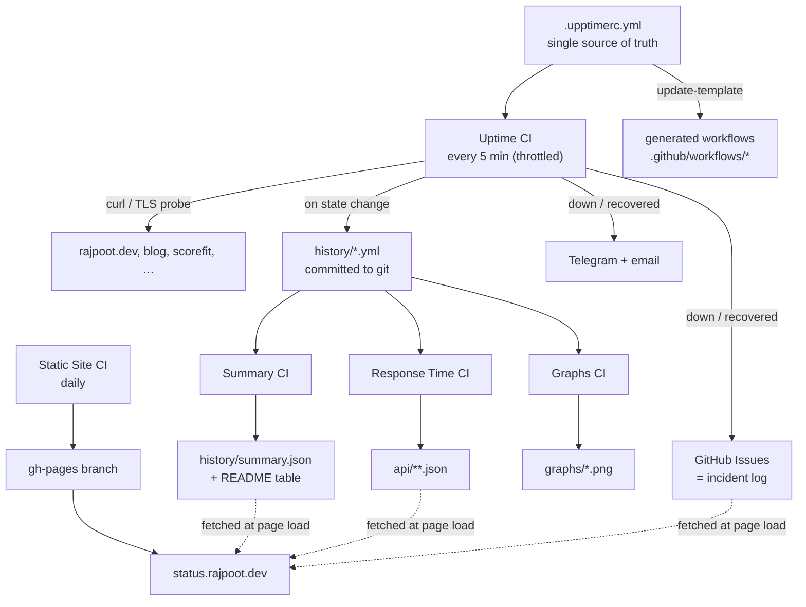

# Architecture

There is no server. Monitoring is GitHub Actions on a cron, storage is git, the
incident tracker is GitHub Issues, and the status page is a static site on
GitHub Pages.

## Data flow

The dotted arrows matter: the status page fetches `api/`, `summary.json` and
issues from GitHub **at page load**, not at build time. That is why live numbers
update without a rebuild — and why the page shows an error rather than stale
data when those files are missing.

## Repository layout

| Path                        | Written by       | Purpose                                          |
| --------------------------- | ---------------- | ------------------------------------------------ |
| `.upptimerc.yml`            | you              | Single source of truth for everything             |
| `.github/workflows/*.yml`   | **generated**    | Eight Upptime-owned workflows — never hand-edit   |
| `.github/workflows/validate.yml` | you         | Safe to edit; not owned by the generator          |
| `.github/scripts/`          | you              | Config validator and local probe                  |
| `tests/`                    | you              | Validator test suite                              |
| `history/*.yml`             | Uptime CI        | Raw check log, one file per monitor               |
| `api/**.json`               | Response Time CI | Uptime/response JSON for the page and badges      |
| `graphs/*.png`              | Graphs CI        | Response-time charts                              |

`history/`, `api/` and `graphs/` are machine-written. Don't edit them by hand.

## Why the workflows are generated

`update-template` deletes and rewrites exactly eight files: `graphs`,
`response-time`, `setup`, `site`, `summary`, `update-template`, `updates`, and
`uptime`. Anything else in `.github/workflows` is left alone — which is why
`validate.yml` can live there safely.

This also means hand-edits to those eight are silently reverted. Change
`.upptimerc.yml` instead; the generator derives cron schedules, the secrets
context, and the site config from it.

Two consequences worth knowing:

- **`update-template` runs `upptime/uptime-monitor@master`**, unpinned by
  upstream's design. Applying upstream changes automatically is an implicit
  trust relationship. Drop the `updateTemplate` schedule to opt out.
- Dependabot is deliberately **not** configured. It would open PRs bumping
  action versions in the generated workflows, and the next `update-template`
  run would revert them.

## Check types

| Type              | What it proves                                    | `url` form      |
| ----------------- | ------------------------------------------------- | --------------- |
| HTTP (default)    | Status code, latency budget, and body content     | `https://host`  |
| `check: ssl`      | Certificate has ≥ 7 days left                     | `host` (bare!)  |

HTTP checks retry automatically — three attempts, 2s then 10s apart — so a
single transient failure does not raise an incident. The `maxRetries` key looks
like it tunes this but only applies to `tcp-ping`.

## Secrets

The generated `uptime.yml` embeds a `SECRETS_CONTEXT` expression listing every
secret the run may see. That list comes from the `secrets:` allowlist in
`.upptimerc.yml`, and when present it is **exhaustive** — a secret missing from
it is invisible to Upptime even if it exists in repository settings. Omitting
the key entirely falls back to a compatibility mode that exposes ~90 provider
variables, so keeping it explicit is deliberate least-privilege.
